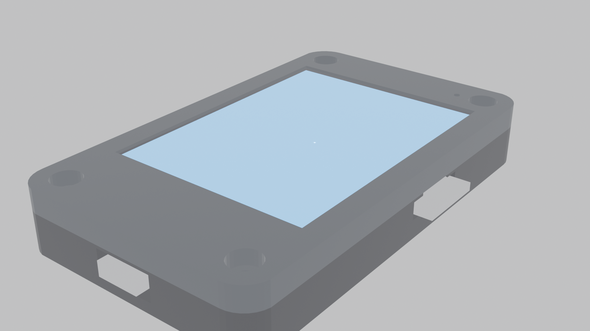
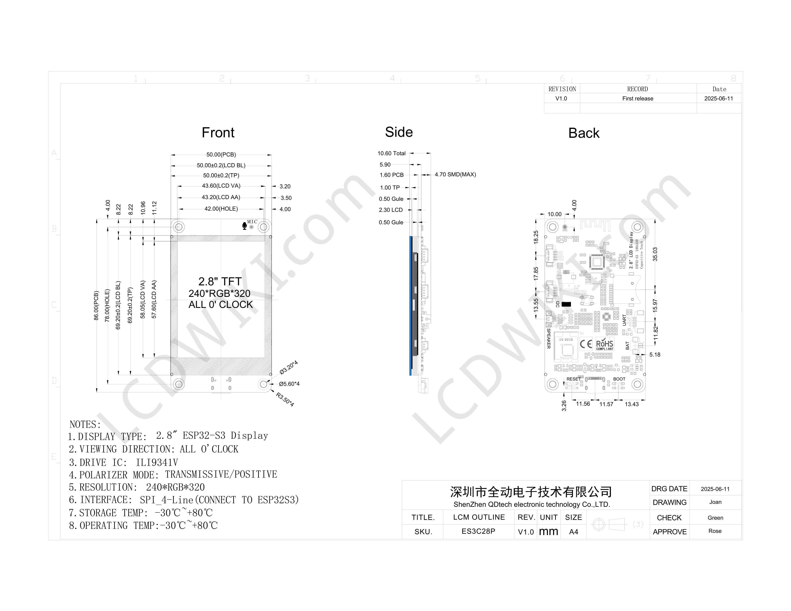
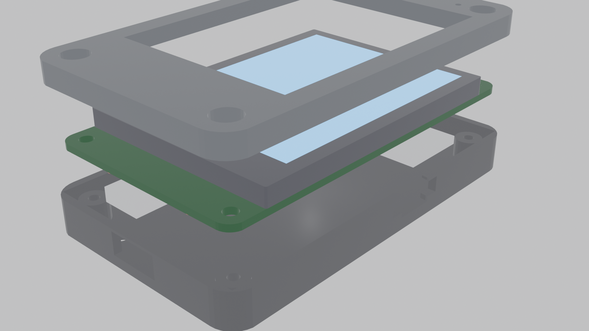

# ESP32-S3 2.8" Touch Display (ES3C28P) — Hermes Voice Satellite & MacroPad



A high-performance, multifunctional firmware and hardware suite for the **ES3C28P** ESP32-S3 2.8" IPS Touch development board. Combines a **Bluetooth Low Energy (BLE) HID MacroPad**, an **Everest Semi ES8311 audio recording engine**, an **AI Voice Satellite for Hermes**, and a **custom 3D-printable enclosure**.

---

## Table of Contents

1. [Hardware Overview & Board Identification](#hardware-overview--board-identification)
2. [Pinout Reference](#pinout-reference)
3. [Firmware Features](#firmware-features)
   - [BLE HID Keyboard Profiles (Pages 1–4)](#ble-hid-keyboard-profiles-pages-14)
   - [Hermes AI Voice Satellite (Page 5)](#hermes-ai-voice-satellite-page-5)
   - [System Telemetry Dashboard & Profile Switcher (Page 6)](#system-telemetry-dashboard--profile-switcher-page-6)
   - [RGB Status LED Indicators](#rgb-status-led-indicators)
4. [Hermes Voice Receiver Server](#hermes-voice-receiver-server)
   - [Architecture & Concurrent Health Authority](#architecture--concurrent-health-authority)
   - [Security Model: Token Separation](#security-model-token-separation)
   - [Workplace Privacy Hardening](#workplace-privacy-hardening)
5. [3D Enclosure & Mechanical Design](#3d-enclosure--mechanical-design)
6. [Getting Started & Configuration](#getting-started--configuration)
   - [Home & Work Environment Setup](#1-home--work-environment-setup)
   - [Building and Flashing with PlatformIO](#2-building-and-flashing-with-platformio)
   - [Running the Hermes Voice Receiver](#3-running-the-hermes-voice-receiver)
   - [Factory Firmware Flasher (flash.py)](#4-factory-firmware-flasher-flashpy)
7. [Repository File Tree](#repository-file-tree)
8. [Comprehensive Architecture Guide (docs/home-work-architecture.md)](docs/home-work-architecture.md)

---

## Hardware Overview & Board Identification

This repository solves the common hardware misidentification surrounding this board:

- **Board Identity:** Spotpear / QD Electronic / LCDWIKI **ES3C28P** (`2.8inch_IPS_ESP32-S3_ILI9341V_ES3C28P`), *not* the Waveshare ESP32-S3-Touch-LCD-2.8.
- **Microcontroller:** ESP32-S3-WROOM-1 (N16R8: 16 MB Quad SPI Flash, 8 MB Octal PSRAM).
- **Display:** 2.8" 240×320 IPS SPI LCD (ST7789 / ILI9341V compatible).
- **Touch Controller:** **FocalTech FT6336G** capacitive touch IC at I2C address `0x38` (interrupt on `GPIO 17`, reset on `GPIO 18`).
- **Audio Codec:** **Everest Semi ES8311** low-power audio codec at I2C address `0x18` over shared I2C bus (`GPIO 16 SDA`, `GPIO 15 SCL`).
- **Audio Power Amplifier:** **FM8002** class-AB audio amplifier driven by `GPIO 1` (`AUDIO_EN`, active-low).
- **Onboard RGB LED:** Single-wire addressable WS2812 NeoPixel on `GPIO 42`.



---

## Pinout Reference

### Display (2.8" 240×320 IPS SPI)
| Signal | ESP32-S3 GPIO | Description |
|---|---|---|
| **TFT_CS** | **GPIO 10** | Chip Select (Active Low) |
| **TFT_MOSI** | **GPIO 11** | SPI Master Out Slave In |
| **TFT_SCK** | **GPIO 12** | SPI Clock |
| **TFT_MISO** | **GPIO 13** | SPI Master In Slave Out |
| **TFT_DC / RS** | **GPIO 46** | Data/Command Select (HIGH = Data, LOW = Command) |
| **TFT_BL** | **GPIO 45** | Backlight Control (HIGH = ON) |
| **TFT_RST** | **CHIP_PU** | Hardware Reset (tied to ESP32 enable pin) |

### Capacitive Touch (FT6336G — I2C: 0x38)
| Signal | ESP32-S3 GPIO | Description |
|---|---|---|
| **TP_SDA** | **GPIO 16** | I2C Data (shared bus with ES8311 Audio Codec) |
| **TP_SCL** | **GPIO 15** | I2C Clock (shared bus with ES8311 Audio Codec) |
| **TP_INT** | **GPIO 17** | Touch Interrupt (Active Low on screen contact) |
| **TP_RST** | **GPIO 18** | Touch Controller Reset (Active Low) |

### Audio System (ES8311 Codec: 0x18 & FM8002 Amplifier)
| Signal | ESP32-S3 GPIO | Description |
|---|---|---|
| **AUDIO_EN (PA)** | **GPIO 1** | FM8002 PA Shutdown (Active Low, held HIGH to mute) |
| **I2S_MCK** | **GPIO 4** | Master Audio Clock (MCLK) |
| **I2S_SCK (BCLK)**| **GPIO 5** | Serial Bit Clock |
| **I2S_DO (ASDOUT)**| **GPIO 6** | Audio Data from ES8311 to ESP32 (Microphone PCM) |
| **I2S_LRC (WS)** | **GPIO 7** | Word Select / Left-Right Clock |
| **I2S_DI (DSDIN)**| **GPIO 8** | Audio Data from ESP32 to ES8311 (Speaker DAC) |

### Additional Peripherals
| Peripheral | Pin | Notes |
|---|---|---|
| **Status RGB LED** | **GPIO 42** | WS2812 addressable RGB LED |
| **Battery ADC** | **GPIO 9** | 1/2 resistor divider for LiPo monitoring |
| **SD Card (SDIO)** | **GPIO 38, 40, 39, 41, 48, 47** | CLK=38, CMD=40, D0=39, D1=41, D2=48, D3=47 |
| **Native USB** | **GPIO 19 (D-), GPIO 20 (D+)** | Direct USB CDC & JTAG flashing |

---

## Firmware Features

The primary firmware is built on PlatformIO using Arduino + ESP-IDF frameworks. It operates as a combined wireless Bluetooth macro keyboard, an internet-connected voice satellite, and a portable environment manager.

### BLE HID Keyboard Profiles (Pages 1–4)

Pairs seamlessly with Windows, macOS, and Linux as **`ESP32 MacroPad`**. Includes custom BLE security configuration (`ESP_LE_AUTH_BOND` with `ESP_IO_CAP_NONE`) to prevent Windows MITM PIN pairing loops.

- **Page 1: Media & Audio Controls**
  - Play / Pause
  - Mute Audio
  - Volume Up (`+`) & Volume Down (`-`)
  - Previous Track (`|<<`) & Next Track (`>>|`)
- **Page 2: Productivity Shortcuts**
  - Copy (`Ctrl+C`), Paste (`Ctrl+V`), Cut (`Ctrl+X`)
  - Undo (`Ctrl+Z`), Select All (`Ctrl+A`), Save (`Ctrl+S`)
- **Page 3: Windows Quick Tools**
  - Snipping Tool (`Win+Shift+S`)
  - Task Manager (`Ctrl+Shift+Esc`)
  - Show Desktop (`Win+D`)
  - File Explorer (`Win+E`)
  - Lock PC (`Win+L`)
  - Calculator
- **Page 4: Special Combos & Chat Keys**
  - Dictation / Emoji Picker (`Win+Ctrl+Space`)
  - Direct `Enter`
  - Chat Soft-Return (`Shift+Enter` — insert newline without submitting)

### Hermes AI Voice Satellite (Page 5)

Turns the touch pad into a physical AI voice satellite:

```
[Touch Button (Hold)] ──> [ES8311 Codec / I2S Mic] ──> [16kHz WAV Compiler]
                                                               │
[LCD Reply Card]      <── [HTTP JSON Response]   <── [Wi-Fi HTTP POST]
```

- **Push-to-Talk Operation:** Hold down the on-screen "Push to Talk" button while speaking.
- **Dynamic Feedback:** Live second timer (`Recording [3 s]...`), audio peak meters (`L:xxx R:xxx`), and visual state transitions.
- **PCM WAV Generation:** Records 16-bit 16 kHz audio into internal PSRAM buffer and wraps it with a proper standard 44-byte WAV header upon release.
- **HTTP Transmission:** Dispatches audio payload over Wi-Fi to the local receiver service.
- **Status Card Display:** Shows live transcription and the Hermes AI reply directly on the 2.8" LCD.

### System Telemetry Dashboard & Profile Switcher (Page 6)

A dedicated telemetry and management view (`< [6/6] >`):
- **Live Diagnostics**: Monitors Wi-Fi (SSID + RSSI), Internet reachability, Bluetooth host pairing, Voice Host readiness, persistent Hermes Gateway (:8642), and local Ollama model residency.
- **Zero-Reflash Portability**: Touch `[ SWITCH TO HOME ]` or `[ SWITCH TO WORK ]` to instantly reconfigure Wi-Fi, endpoint URLs, auth tokens, and timeouts. Selections are persisted in ESP32 Non-Volatile Storage (NVS via Arduino `Preferences`) across power cycles.
- **Subsystem Decoupling**: MacroPad readiness (BLE) and Voice readiness (Wi-Fi + AI) are evaluated independently; the terminal never marks itself failed if mobile internet is toggled off on your hotspot.

### RGB Status LED Indicators

| Color | State | Meaning |
|---|---|---|
| **Blue (Solid)** | Booting | Firmware starting up and initializing peripherals |
| **Amber (Breathing)** | Disconnected | BLE advertising; waiting for host pairing |
| **Green (Solid)** | Connected | BLE paired and ready |
| **White (Flash)** | Interaction | Haptic touch press confirmation |
| **Red (Solid)** | Voice Active | Microphone recording in progress |
| **Yellow / Amber (Solid)**| Uploading | Transmitting voice payload to Hermes gateway |
| **Bright Green (Flash)** | Success | Voice query recognized and reply received |

---

## Hermes Voice Receiver Server

Located in `server/`, this lightweight Python service acts as the authoritative bridge between the ESP32 terminal and Hermes:

- **Audio Intake & Threading Concurrency:** Built with Python's `ThreadingHTTPServer` on port `8787`. Background health probes (`GET /health`, `GET /status`) return in $<50\text{ ms}$ concurrently even during active Whisper transcription or LLM inference. Competing audio uploads are rejected with HTTP 429 (Busy).
- **Persistent Hermes Gateway:** Queries Hermes directly at `http://127.0.0.1:8642/v1/chat/completions` using low-latency session reuse, bypassing slow one-shot process spawns.
- **Local Transcription:** Uses `faster-whisper` (`base` model, `int8` quantization, `beam_size=1`, VAD filtering) for rapid, low-latency speech-to-text.
- **TFT Display Sanitization:** Automatically strips markdown formatting, bold markers, bullets, and emojis before sending responses to the ESP32.
- **Deep Health Authority (`GET /status`):** Probes Hermes detailed readiness, Ollama VRAM model residency, Whisper readiness, and returns structured execution timing (`whisper_ms`, `hermes_ms`, `server_ms`).

### Security Model: Token Separation

The receiver separates network tokens from master agent keys:
- **`VOICE_RECEIVER_TOKEN`**: Shared bearer secret between the ESP32 and Voice Receiver over the local network / hotspot. Validated on `POST /voice` and `GET /status`.
- **`API_SERVER_KEY`**: Stored locally on the host (`~/.hermes/.env`) and used exclusively on loopback (`127.0.0.1:8642`) to authenticate against Hermes.

### Workplace Privacy Hardening

- **Local GPU Inference**: At School/Work, Hermes is paired with local Ollama (`127.0.0.1:11434`), ensuring zero cloud dependencies.
- **Telegram Mirror Suppression**: When `RECEIVER_ENV=work`, Telegram mirroring is automatically suppressed so no voice transcripts leave the workstation.
- **GPU Warmup & Keep-Alive**: Launches with `OLLAMA_KEEP_ALIVE=8h` and issues an automated startup preload probe so the model remains warm in VRAM.

---

## 3D Enclosure & Mechanical Design



A complete 3D printable enclosure has been modeled specifically for the ES3C28P board geometry:

- **STEP CAD Model:** `docs/dimensions/3d_model/ES3C28P_3D/ES3C28P_3D.step`
- **Ready-to-Print STLs (`docs/dimensions/case_stl/`):**
  - `Case_Top.stl`: Bezel with screen window, onboard microphone cutout, and tactile button openings.
  - `Case_Bottom.stl`: Base enclosure with side cutouts for USB-C, power switch, and microSD slot.
  - `Full_Enclosure_Assembly.stl`: Combined assembly for inspection in slicers.
- **Procedural & Render Scripts:**
  - `generate_case.py`: Python script for programmatic CAD modeling.
  - `blender_client.py`, `render_views.py`, `render_beauty_shots.py`: Headless Blender automation scripts to generate photorealistic multi-angle renders.

---

## Getting Started & Configuration

### 1. Home & Work Environment Setup

To keep private network credentials secure, configuration is separated from version control:

1. Copy `src/wifi_config.h.example` to `src/wifi_config.h`:
   ```bash
   cp src/wifi_config.h.example src/wifi_config.h
   ```
2. Open `src/wifi_config.h` and configure both composite profiles:
   ```c
   #pragma once

   // HOME Profile (Home Linux Server & Home Wi-Fi)
   #define HOME_ENV_NAME          "HOME"
   #define HOME_WIFI_SSID         "Your_Home_SSID"
   #define HOME_WIFI_PASSWORD     "Your_Home_Password"
   #define HOME_RECEIVER_URL      "http://192.168.0.45:8787/voice"
   #define HOME_STATUS_URL        "http://192.168.0.45:8787/status"
   #define HOME_AUTH_TOKEN        "your_home_receiver_token"
   #define HOME_BLE_HOST          "Home Desktop"
   #define HOME_VOICE_TIMEOUT_MS  25000

   // WORK Profile (School Windows PC & Phone Hotspot)
   #define WORK_ENV_NAME          "WORK"
   #define WORK_WIFI_SSID         "Your_Hotspot_SSID"
   #define WORK_WIFI_PASSWORD     "Your_Hotspot_Password"
   #define WORK_RECEIVER_URL      "http://10.170.101.33:8787/voice"
   #define WORK_STATUS_URL        "http://10.170.101.33:8787/status"
   #define WORK_AUTH_TOKEN        "your_work_receiver_token"
   #define WORK_BLE_HOST          "School Desktop"
   #define WORK_VOICE_TIMEOUT_MS  65000
   ```
   *(Note: `src/wifi_config.h` is excluded by `.gitignore` and will not be committed.)*

### 2. Building and Flashing with PlatformIO

1. Install [PlatformIO Core](https://platformio.org/install/cli) or use the PlatformIO extension in VS Code.
2. Connect the ESP32-S3 via the **Native USB** port.
3. Verify or set your COM port in `platformio.ini`:
   ```ini
   upload_port = COM5
   ```
4. Build and upload:
   ```bash
   pio run --target upload
   ```
5. View serial output:
   ```bash
   pio device monitor
   ```

### 3. Running the Hermes Voice Receiver

1. Navigate to the `server/` directory:
   ```bash
   cd server
   ```
2. Install Python dependencies:
   ```bash
   pip install faster-whisper
   ```
3. Run the receiver using the batch script or Python directly:
   ```bash
   start_receiver.bat
   # Or:
   python hermes_voice_receiver.py
   ```

### 4. Factory Firmware Flasher (`flash.py`)

A standalone flashing utility is provided to quickly test factory reference firmwares without compiling:

```bash
# Interactive LVGL widgets demo
python flash.py widgets COM5

# Music player UI demo
python flash.py music COM5

# Benchmark demo
python flash.py benchmark COM5

# Stress test demo
python flash.py stress COM5

# Xiaozhi AI Voice demo
python flash.py xiaozhi COM5
```

---

## Repository File Tree

```
ESP32 project/
├── .gitignore                    # Ignores build artifacts and wifi_config.h
├── platformio.ini                # PlatformIO environment configuration
├── README.md                     # Project documentation
├── flash.py                      # One-click demo firmware flasher
├── generate_case.py              # Procedural enclosure generator
├── blender_client.py             # Blender automation client
├── render_views.py               # Enclosure CAD view renderer
├── render_beauty_shots.py        # Studio beauty shot renderer
├── bin/                          # Factory prebuilt demo binaries
├── docs/                         # Schematics, datasheets, and 3D assets
│   ├── dimensions/               # Enclosure renders, drawings, and CAD models
│   │   ├── 3d_model/             # Official ES3C28P STEP 3D CAD model
│   │   └── case_stl/             # 3D printable STL files (Top, Bottom, Assembly)
│   ├── Dashboard-plan.md         # Home/Work architecture engineering roadmap
│   ├── home-work-architecture.md # Comprehensive portable setup and deployment guide
│   ├── schematic.pdf             # Complete hardware schematic
│   └── pinout_allocation.xlsx    # Full pin allocation workbook
├── lib/                          # Driver libraries
│   ├── Adafruit_NeoPixel/        # WS2812 RGB LED driver
│   ├── ESP32-BLE-Keyboard/       # BLE HID keyboard library with Windows pairing patch
│   ├── FT6336/                   # FocalTech FT6336G capacitive touch driver
│   └── TFT_eSPI/                 # High-speed SPI display driver (ILI9341V)
├── server/                       # Host AI receiver service
│   ├── hermes_voice_receiver.py  # Concurrent ThreadingHTTPServer, Whisper, & Hermes bridge
│   ├── start_receiver.bat        # Windows launcher (Work mode, Ollama keep-alive)
│   ├── start_receiver.sh         # Linux launcher (Home server hosting)
│   ├── receiver.env.example      # Environment configuration template
│   └── benchmark_hermes_standalone.py # CLI vs persistent gateway benchmark utility
└── src/                          # Firmware source code
    ├── main.cpp                  # Main loop, BLE setup, and event dispatcher
    ├── macropad_config.h / .cpp  # 6-page macro profiles, key combos, and color palette
    ├── gui.h / .cpp              # TFT_eSPI GUI engine, voice cards, & Page 6 dashboard
    ├── environment_manager.h/.cpp# Composite profiles & NVS Preferences persistence
    ├── system_status.h           # HealthState & DashboardStatus telemetry structures
    ├── audio_recorder.h / .cpp   # I2S DMA audio capture and WAV builder
    ├── es8311.h / .cpp           # Everest Semi ES8311 I2C codec driver
    ├── es8311_reg.h              # ES8311 register map
    ├── network_manager.h / .cpp  # Strict profile networking, composite health & audio upload
    └── wifi_config.h.example     # HOME and WORK composite credentials template
```
