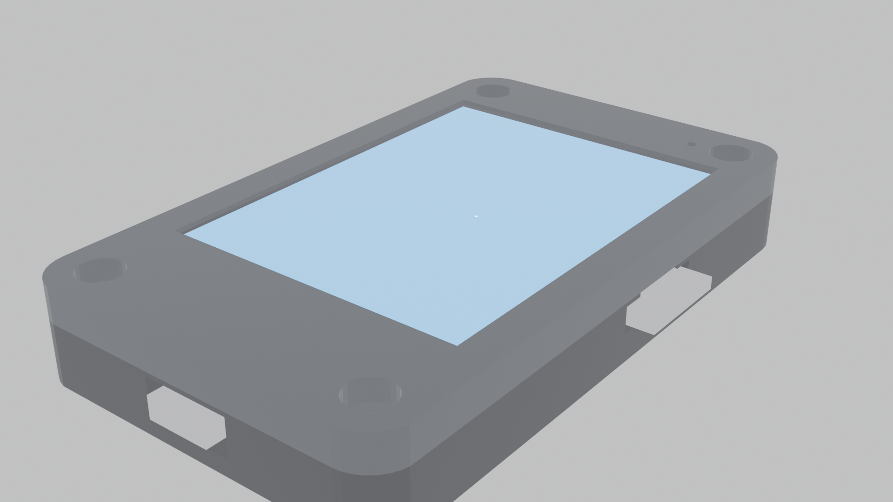

# Build an ESP32 classroom companion with an AI coding agent



A small touchscreen device for Bluetooth shortcuts, push-to-talk AI conversations and everyday classroom tasks. This repository contains the firmware, host receiver, hardware references and enclosure models for the **LCDWIKI / QD Electronic ES3C28P ESP32-S3 board**.

This guide shows how to take the project from a downloaded repository to a working device, using **Cursor or local Codex for development**, **USB for programming the ESP32**, and **Blender MCP to help design and refine its enclosure**.

**[Follow the detailed build guide](docs/build-guide.md)** · **[Hardware and pinout](docs/hardware-reference.md)** · **[Enclosure files](docs/dimensions/)**

## The development process

The project grew through a repeated cycle: describe a useful task, turn it into a small implementation plan, let an IDE agent help write the code, test it on the physical device, and use the results to make the next change.

There are two hands-on parts to that process:

- **Electronics and software:** the agent reads and edits the local repository, runs PlatformIO, uploads firmware over USB and helps interpret serial logs. You test the screen, buttons, Bluetooth and audio.
- **Mechanical design:** the agent uses Blender MCP to inspect and change an enclosure in Blender. You check dimensions against the board and battery, inspect the exported model in a slicer and test the printed fit.

Start by getting the existing firmware working. Add your own features and enclosure changes once you have a baseline you can return to.

## What connects to what?

| Connection | Purpose | How you make it |
|---|---|---|
| Development computer to ESP32 | Build, upload firmware and read logs | USB data cable and PlatformIO |
| ESP32 to the computer being controlled | Send keyboard shortcuts and media keys | Pair `ESP32 MacroPad` over Bluetooth |
| ESP32 to voice receiver | Send recorded speech and receive replies | Wi-Fi to the host receiver on TCP port 8787 |
| Local IDE agent to Blender | Inspect and edit the enclosure | Blender MCP server plus Blender add-on |
| Voice receiver to AI backend | Transcribe speech and obtain a reply | Local Python receiver, Hermes and/or Ollama |

Blender MCP controls Blender. Firmware uploading uses PlatformIO. For the simplest setup, run the IDE agent, Blender and PlatformIO on the computer with the ESP32 plugged into it. A hosted coding session needs a separate, explicit connection to that computer before it can access its USB device or Blender.

## What you need

- **ES3C28P board:** ESP32-S3, 16 MB flash, 8 MB PSRAM, 2.8-inch (about 71 mm diagonal) 240 × 320 touchscreen and ES8311 audio hardware. The firmware is configured for this board; other ESP32 touchscreen boards need their own pin mapping and drivers.
- A USB **data** cable, a computer and Bluetooth support on the computer you want to control.
- Git, PlatformIO Core, and Cursor or a local Codex client with access to the project folder and terminal.
- For enclosure work: Blender, Blender MCP and a slicer; a 3D printer if you want to print it.
- For voice: Python, `faster-whisper`, Wi-Fi, and a configured Hermes installation and/or local Ollama model.
- Optional: a compatible 3.7 V single-cell rechargeable battery and microSD card.

## 1. Download and open the project

In your terminal:

```bash
git clone https://github.com/dsuth10/ESP32-project.git
cd ESP32-project
git switch -c my-classroom-companion
```

Open this folder in your IDE. The main firmware is the **root PlatformIO project**, configured by [platformio.ini](platformio.ini); `esp-idf-lvgl/` contains a separate reference/demo project.

Give the agent a specific first task:

> Read README.md, docs/build-guide.md, platformio.ini, GEMINI.md and the relevant source files. Explain the build environment, USB connection and configuration I need for this ES3C28P board. Check the installed tools and list connected serial ports before changing anything.

[GEMINI.md](GEMINI.md) records engineering constraints learnt during development. Ask whichever agent you use to read it explicitly.

## 2. Connect the ESP32 over USB

Plug the board's USB-C/native USB connection into the development computer using a data cable. Then run:

```bash
pio device list
```

On Windows, check **Device Manager → Ports (COM & LPT)**. The repository currently specifies `COM5`, but your device may use another port. Update both `upload_port` and `monitor_port` in `platformio.ini`, or supply the port in the commands below.

The [build guide](docs/build-guide.md#3-connect-the-board-build-and-upload) includes bootloader recovery if the board does not appear.

## 3. Configure, build and upload

Copy the credentials template to a local configuration file. On Windows PowerShell:

```powershell
Copy-Item src/wifi_config.h.example src/wifi_config.h
```

On Linux/macOS:

```bash
cp src/wifi_config.h.example src/wifi_config.h
```

Fill in your own Wi-Fi names, passwords and receiver addresses. The local file is excluded by `.gitignore`. For Bluetooth-only testing, use valid C strings with placeholder network values until you are ready to configure voice.

Build first, then upload and monitor. Replace `COM5` with your detected port:

```bash
pio run -e esp32-s3-portrait
pio run -e esp32-s3-portrait -t upload --upload-port COM5
pio device monitor --port COM5 --baud 115200
```

Close the serial monitor with **Ctrl+C** before uploading again. The default interface is portrait; the legacy landscape build uses environment `esp32-s3-devkitc-1`. See [the orientation guide](docs/PORTRAIT_UI.md).

**Checkpoint:** the screen boots, touch navigation responds and serial logs are readable.

## 4. Pair Bluetooth and try a shortcut

On the computer you want to control, open Bluetooth settings, add a device and select **ESP32 MacroPad**. Open a disposable text document and test Copy, Paste or Enter. Test volume control separately.

The current profile order in [src/macropad_config.cpp](src/macropad_config.cpp) is:

| Profile | What it does |
|---|---|
| System | Connection dashboard, Home/Work selection, volume and power controls |
| Media & Audio | Playback, mute, track and volume controls |
| Productivity | Copy, paste, undo, select all, save and cut |
| Windows Tools | Windows shortcuts such as Snipping Tool and File Explorer |
| Custom Keys | Configurable key combinations, Enter and Shift+Enter |
| Hermes Voice | Hold-to-talk, reply display, chat scrolling and audio toggle |
| Storage Explorer | Browse a microSD card |

These are the source profile names; older plans use different page numbers. Some shortcuts are Windows-specific and may need adapting for another operating system.

**Checkpoint:** a touch on the device causes the expected action on the paired computer.

## 5. Make a small change with your IDE agent

For example:

> Change one Custom Keys button to send Ctrl+Shift+M and label it MIC TOGGLE. Preserve the existing layout, touch handling and other profiles. Build the portrait firmware, show the diff, then upload to my detected USB port. I will test whether the target application recognises that shortcut.

The agent can help edit, compile, upload and diagnose. The physical test tells you whether the change actually works in your application. Save a working commit before tackling a larger feature.

Opening an application on a particular monitor or navigating to a OneNote page needs host-side automation as well as a device trigger. The [OneNote automation plan](docs/ESP32_Classroom_Companion_OneNote_Automation_Plan.md) describes that proposed extension.

## 6. Connect Blender MCP and refine the case

Open [docs/Case.blend](docs/Case.blend) or an appropriate battery enclosure in [docs/dimensions/](docs/dimensions/), and save a working copy.

Install the Blender MCP add-on and configure it in **either Cursor or Codex**, following the [Blender setup steps](docs/build-guide.md#6-connect-blender-mcp). Verify the connection with a simple request to list scene objects before asking the agent to change the case.

Then try:

> Inspect the enclosure and report its dimensions in millimetres. Compare it with the supplied board drawing and my measured board. Preserve the screen opening, USB access, microphone opening and mounting points. Propose the changes needed for my measured battery before editing. Save a separate Blender file and export each printable shell separately.

Use the [dimension drawing](docs/dimensions/ES3C28P_Size.pdf), your actual hardware and the supplied models as references. Check the STL size in the slicer: changing Blender's display units alone does not prove the export scale is correct.

The existing [top and bottom STLs](docs/dimensions/case_stl/) are a starting point. `Full_Enclosure_Assembly.stl` includes reference electronics and is for inspection; print the shell parts separately.

**Checkpoint:** the agent can inspect Blender, and your exported parts have the expected dimensions and clearances.

## 7. Add voice once the basic device works

The ESP32 records speech; the host computer runs transcription and AI processing. Start on the same local Wi-Fi network.

Follow [the receiver setup](docs/build-guide.md#5-set-up-the-optional-voice-receiver) to install dependencies, configure authentication, start the service and test its health endpoint.

The current receiver has two routes:

| Receiver mode | First backend attempted | Fallback |
|---|---|---|
| Home | Hermes session API | Direct local Ollama |
| Work | Direct local Ollama | Hermes session API |

A reply alone does not prove Hermes handled it. Check `Backend used` in the receiver log. Work mode disables Telegram mirroring, but a local-only setup also requires local models and a local Hermes fallback configuration.

**Checkpoint:** hold the talk button, speak a short question, release it, and receive a transcription and reply.

## 8. Test, print and keep improving

Test USB boot, touch, Bluetooth, voice, profile switching and battery operation separately. A successful build checks the software; it cannot check a printed fit, microphone opening or battery connection.

For a battery, verify the connector, polarity and charging requirements against the [board manual](docs/user_manual.pdf) before connecting it. Measure the battery and leave room for its lead and connector.

Keep each improvement small enough to test and explain. Record your tool versions, working firmware commit and print settings so the next person can reproduce your results.

## Further reading

- [Detailed build guide: tools, agent prompts, USB, Blender MCP and troubleshooting](docs/build-guide.md)
- [Hardware identification and pinout](docs/hardware-reference.md)
- [Home/Work architecture design notes](docs/home-work-architecture.md) — compare design intentions with the current receiver routing described above
- [Portrait upload and landscape restore](docs/PORTRAIT_UI.md)
- [Board schematic](docs/schematic.pdf) and [user manual](docs/user_manual.pdf)
- [Enclosure generator](generate_case.py) and [render scripts](render_views.py)

The enclosure scripts contain machine-specific output paths. Read and adapt them before running them. The main firmware uses Arduino through PlatformIO, TFT_eSPI for drawing, and the bundled board drivers; installing Blender MCP does not add an ESP32 programming tool.
