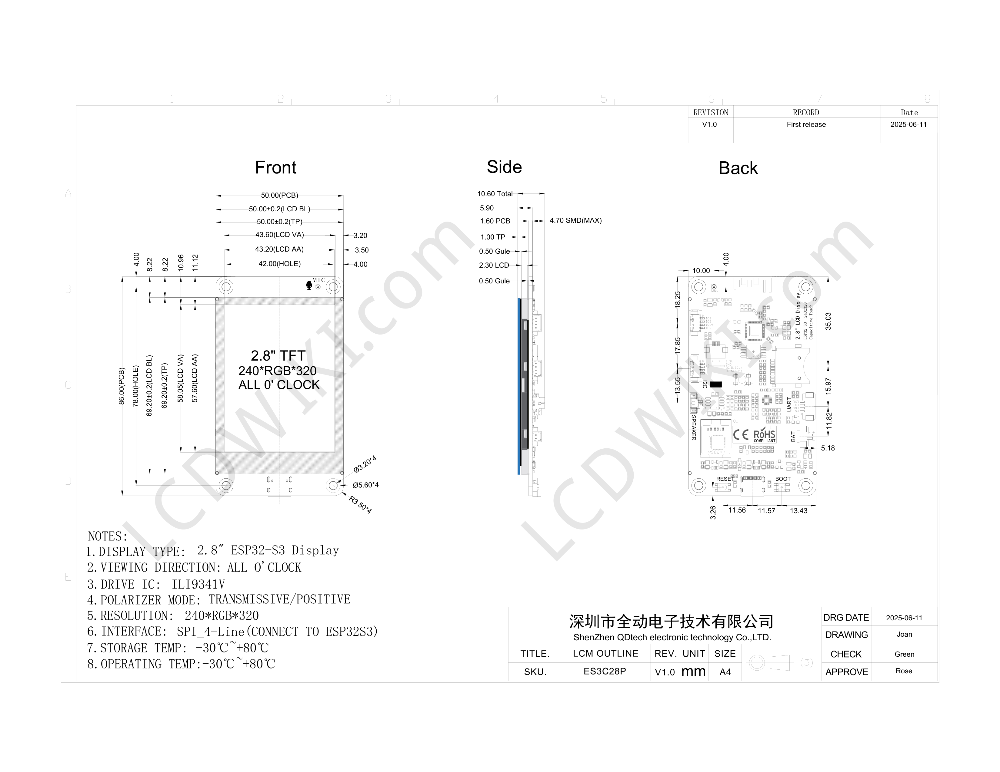

# ES3C28P hardware reference

[Back to the build guide](../README.md)

This pinout is retained from the project's technical reference. Confirm it against your board revision, the [schematic](schematic.pdf) and [user manual](user_manual.pdf) before adding external hardware. The primary PlatformIO environment uses Arduino; its CPU is set to 240 MHz, with 16 MB flash and 8 MB PSRAM configuration.

## Hardware Overview & Board Identification

The firmware targets the ES3C28P. Similar-looking boards can use different pin assignments and peripherals.

- **Board Identity:** Spotpear / QD Electronic / LCDWIKI **ES3C28P** (`2.8inch_IPS_ESP32-S3_ILI9341V_ES3C28P`), *not* the Waveshare ESP32-S3-Touch-LCD-2.8.
- **Microcontroller:** ESP32-S3-WROOM-1 (N16R8: 16 MB Quad SPI Flash, 8 MB Octal PSRAM).
- **Display:** 2.8-inch 240×320 IPS SPI LCD (ST7789 / ILI9341V compatible).
- **Touch Controller:** **FocalTech FT6336G** capacitive touch IC at I2C address `0x38` (interrupt on `GPIO 17`, reset on `GPIO 18`).
- **Audio Codec:** **Everest Semi ES8311** low-power audio codec at I2C address `0x18` over shared I2C bus (`GPIO 16 SDA`, `GPIO 15 SCL`).
- **Audio Power Amplifier:** **FM8002** class-AB audio amplifier driven by `GPIO 1` (`AUDIO_EN`, active-low).
- **Onboard RGB LED:** Single-wire addressable WS2812 NeoPixel on `GPIO 42`.

---

## Pinout Reference

### Display (2.8-inch 240×320 IPS SPI)
| Signal | ESP32-S3 GPIO | Description |
|---|---|---|
| **TFT_CS** | **GPIO 10** | Chip Select (Active Low) |
| **TFT_MOSI** | **GPIO 11** | SPI Master Out Slave In |
| **TFT_SCK** | **GPIO 12** | SPI Clock |
| **TFT_MISO** | **GPIO 13** | SPI Master In Slave Out |
| **TFT_DC / RS** | **GPIO 46** | Data/Command Select (HIGH = Data, LOW = Command) |
| **TFT_BL** | **GPIO 45** | Backlight Control (HIGH = ON) |
| **TFT_RST** | **CHIP_PU** | Hardware Reset (tied to ESP32 enable pin) |

### Capacitive Touch (FT6336G — I2C: 0x38)
| Signal | ESP32-S3 GPIO | Description |
|---|---|---|
| **TP_SDA** | **GPIO 16** | I2C Data (shared bus with ES8311 Audio Codec) |
| **TP_SCL** | **GPIO 15** | I2C Clock (shared bus with ES8311 Audio Codec) |
| **TP_INT** | **GPIO 17** | Touch Interrupt (Active Low on screen contact) |
| **TP_RST** | **GPIO 18** | Touch Controller Reset (Active Low) |

### Audio System (ES8311 Codec: 0x18 & FM8002 Amplifier)
| Signal | ESP32-S3 GPIO | Description |
|---|---|---|
| **AUDIO_EN (PA)** | **GPIO 1** | FM8002 PA Shutdown (Active Low, held HIGH to mute) |
| **I2S_MCK** | **GPIO 4** | Master Audio Clock (MCLK) |
| **I2S_SCK (BCLK)**| **GPIO 5** | Serial Bit Clock |
| **I2S_DO (ASDOUT)**| **GPIO 6** | Audio Data from ES8311 to ESP32 (Microphone PCM) |
| **I2S_LRC (WS)** | **GPIO 7** | Word Select / Left-Right Clock |
| **I2S_DI (DSDIN)**| **GPIO 8** | Audio Data from ESP32 to ES8311 (Speaker DAC) |

### Additional Peripherals
| Peripheral | Pin | Notes |
|---|---|---|
| **Status RGB LED** | **GPIO 42** | WS2812 addressable RGB LED |
| **Battery ADC** | **GPIO 9** | 1/2 resistor divider for LiPo monitoring |
| **SD Card (SDIO)** | **GPIO 38, 40, 39, 41, 48, 47** | CLK=38, CMD=40, D0=39, D1=41, D2=48, D3=47 |
| **Native USB** | **GPIO 19 (D-), GPIO 20 (D+)** | Direct USB CDC & JTAG flashing |

---

## Mechanical files

- [Board dimensions](dimensions/ES3C28P_Size.pdf)
- [Specification](dimensions/ES3C28P_Specification.pdf)
- [STEP model](dimensions/3d_model/ES3C28P_3D/ES3C28P_3D.step)
- [Blender case](Case.blend)
- [Printable top](dimensions/case_stl/Case_Top.stl) and [bottom](dimensions/case_stl/Case_Bottom.stl)

Use your measured hardware to check fit. The assembly STL contains reference electronics as well as the shells. Battery dimensions must include the lead, connector and enough clearance to avoid compressing the cell. A matching connector shape does not establish matching polarity; verify the battery connection against the board manual.
