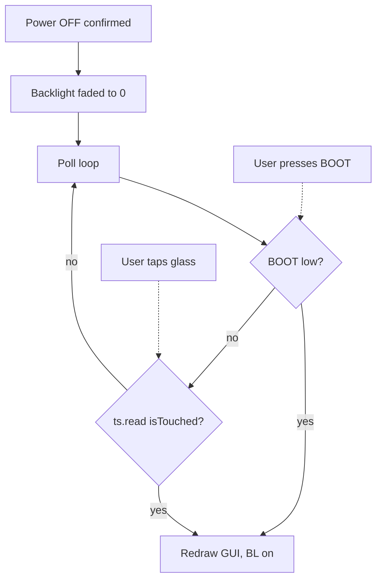

# Soft power-off and touch-to-wake — investigation report

**Board:** Spotpear / QD ES3C28P (ESP32-S3, ILI9341/ST7789 320×240, FT6336G)  
**Date:** 20 September 2026  
**Status:** Soft-off UI exists and **BOOT wake works**. **Tap-to-wake has failed on every firmware attempt.**  
**Code as flashed:** `PowerManager::enterSoftOff()` polls `ts.read()` with the backlight off; it does not use deep sleep or light sleep.

---

## 1. Goal

Make the device feel like a normal gadget with no extra hardware switch:

1. On-screen **Power** on the System Dashboard (pager 1/7).
2. Confirm: Cancel / Power off.
3. Screen goes black, radios stop, speaker muted.
4. **Tap the dark glass to turn it back on.** BOOT remains a fallback.
5. USB charging still works while it looks off (TP4054 is independent of the ESP32).

This board **cannot cut the LiPo in firmware**. The P-channel MOSFET is switched by USB 5 V, not by a GPIO. “Off” can only be a low-power software state.

---

## 2. Hardware facts that constrain the design

| Signal | GPIO | Role in wake |
|---|---|---|
| BOOT button | 0 | Active-low, hard short to ground. Proven wake source. |
| FM8002 PA enable | 1 | Active-low. Must stay high while “off” or the speaker can pop. |
| FT6336 I2C SCL / SDA | 15 / 16 | Shared with ES8311. This is how the GUI already reads touches. |
| FT6336 INT | 17 | Datasheet/pinout: active-low on touch. **Never used by our GUI.** |
| FT6336 RST | 18 | Must stay high or the touch IC resets. |
| Backlight | 45 | High = on. Not an RTC GPIO. |
| RGB LED | 42 | Not an RTC GPIO. |

The running GUI never looks at GPIO17. Every on-screen tap is `FT6336::read()` over I2C (`TD_STATUS` at 0x02). `isTouched` is true only when that register is **1 or 2**. Any other value, including I2C failure `0xFF`, is treated as “not touched.”

BOOT is a mechanical short. The FT6336 INT pad is a weak open-drain. Those two are not equivalent wake sources.

---

## 3. What we implemented (and what you saw)

### 3.1 Product UI (this part works)

- Red power glyph on the System Dashboard telemetry header.
- Modal: **Power off?** → CANCEL / POWER OFF.
- Splash: “Going to sleep…”
- Wi-Fi stop, telemetry task deleted, amplifier muted, LED off, backlight faded.

### 3.2 Attempt A — ESP32 deep sleep + EXT1 on GPIO17

**Idea:** Bruce-style `esp_deep_sleep_start()`, BOOT on EXT0, touch INT on EXT1 `ANY_LOW`.

**Result:** Only BOOT woke the device.

**Why it failed (now understood):**

- `gpio_deep_sleep_hold_en()` force-holds **all digital pads**.
- EXT1, if RTC peripherals power down, also **holds the wake pin at its idle level (high)**.
- An open-drain INT cannot pull a held-high pad low. BOOT can, because it is a hard ground.

### 3.3 Attempt B — Deep sleep, but put touch on EXT0

**Idea:** EXT0 already worked for BOOT, so move GPIO17 to EXT0 and BOOT to EXT1. Arm wake **before** pad hold. Keep RTC peripherals on.

**Result:** Still only BOOT.

**Likely leftover causes:** global pad hold still freezing GPIO17; FT6336 not actually asserting INT; RST/I2C remux glitching the touch IC into reset or hibernate.

USB dropped while asleep, so we could not flash until you pressed BOOT.

### 3.4 Attempt C — Light sleep + GPIO wakeup + 150 ms I2C poll

**Idea:** Do not deep-sleep. Use `esp_light_sleep_start()` with GPIO0/GPIO17 low-level wake, and on timer wake call `ts.read()`.

**Result:** Still only BOOT.

**Likely cause:** Light sleep did not return on the timer (BLE still running is a common ESP32 reason). The I2C poll never ran. Only the BOOT GPIO unblocked `esp_light_sleep_start()`.

### 3.5 Attempt D — No sleep at all; poll I2C like the GUI (current flash)

**Idea:** Leave the CPU running. Black screen, Wi-Fi off. Loop:

```text
if BOOT low → wake
ts.read()
if isTouched → wake
delay(40 ms)
```

This is the **same I2C path that already moves buttons on the dashboard**. It does not send LCD `SLPIN`, does not change FT6336 power registers, and does not enter light/deep sleep.

**Result you reported:** still did not come back with a tap; BOOT still did.

That is the important result. It means we are not only fighting ESP32 sleep. **While the backlight is off, `ts.read()` is not seeing a finger.** If it were, the loop would have exited without BOOT.

---

## 4. What the current failure actually proves

You used BOOT to get the picture back. In the current firmware BOOT is only sampled **inside** `enterSoftOff()`. So:

- The device **was** in the poll loop (not crashed, not stuck in Wi-Fi teardown).
- GPIO0 was read correctly.
- `FT6336::read()` never set `isTouched`.

So tap-to-wake is failing at **touch sensing or I2C**, not at “the CPU is asleep and cannot be interrupted.”



Observed path: G never takes the yes branch; H does.

---

## 5. Leading explanations (ordered)

### 5.1 Capacitive touch dies when the backlight is off — most likely

Many 2.8" IPS + FT6336 modules only report touches while the panel analog/backlight rail is up. Mutual-capacitance sensing sits on the glass over the LCD. Turning GPIO45 low can:

- collapse a rail the CTP analog front-end shares, or
- change the dielectric so the FT6336 reports zero points.

That matches every attempt: we always turned the backlight fully off, and touch wake never worked; BOOT does not need the panel.

**Test:** Soft-off but leave backlight at a very low PWM (or even full on) and poll I2C. If taps wake only when BL is on, this is the cause.

### 5.2 I2C read returns `0xFF` (NACK) during soft-off

`isTouched` requires `TD_STATUS` in `{1,2}`. A failed `Wire.read()` is `0xFF`, which is treated as not touched. Same symptom as 5.1, different cause (bus/reset/clock).

**Test:** Log raw `TD_STATUS`, `Wire.lastError()`, and chip ID `0xA8` every poll.

### 5.3 GPIO17 INT never fires on this unit

The GUI never needed INT, so we have **no evidence** it toggles. Pinout says it should. If it does not, deep/light-sleep IRQ wake can never work. I2C poll can still work **if** the sensor still scans (see 5.1).

**Test:** With the dashboard on, print GPIO17 while tapping. Expect 1 idle, 0 while a finger is down (level mode).

### 5.4 We woke from touch but the backlight never came back

After LEDC fade, `digitalWrite(PIN_TFT_BL, HIGH)` on resume can fail if the LEDC driver still owns GPIO45. Then a tap would “wake” logic but the screen would stay black, and you would press BOOT.

Slightly weaker fit: BOOT does not reset the chip; it only exits the same loop and then drives BL high. If LEDC were stuck, BOOT would also leave you with a black screen. You got a picture back, so BL **can** be turned on after BOOT. A touch-wake that returned from the loop should have used the same `digitalWrite(HIGH)`. So this is less likely than 5.1/5.2 unless touch never returned.

### 5.5 FT6336 reset glitch

`rtc_gpio_init(RST)` in earlier builds can pulse GPIO18 low. The current poll build does not remux RST. Residual hold from an older sleep is cleared in `PowerManager::begin()`. Unlikely for Attempt D unless RST is still being disturbed.

---

## 6. How to solve it

Do not change three variables at once. The next work should **measure**, then pick one product path.

### Step 1 — Serial evidence (do this first)

In the poll loop, print once per second:

- raw `TD_STATUS`
- `isTouched`
- `digitalRead(GPIO17)`
- `digitalRead(GPIO0)`

Power off, tap several times, then BOOT. The log tells us which of 5.1–5.3 we have.

Recommended: keep this as a `sleep` serial dump, not guesswork.

### Step 2 — Backlight experiment (highest value)

| Experiment | If tap wakes | Conclusion |
|---|---|---|
| Soft-off, **BL left on** | Yes | Touch IC is fine; BL-off kills sensing. |
| Soft-off, **BL at ~5% PWM** | Yes | We can look “off” enough and still wake. |
| Soft-off, BL off, but log shows `TD_STATUS=0` while tapping | — | Confirm 5.1. |
| Soft-off, BL off, `TD_STATUS=0xFF` | — | I2C is dead; fix Wire/RST, not IRQ. |
| Dashboard on, GPIO17 never goes low while `isTouched` | — | INT is unusable; never use EXT0/EXT1 for touch. |

**Recommended product if 5% PWM works:** treat “off” as backlight nearly off + Wi-Fi down + I2C poll or INT. Not true deep sleep. Looks off in a pocket; tap still works.

### Step 3 — Choose a product architecture

| Option | What it is | When to use | Trade-off |
|---|---|---|---|
| **A. Dim-BL + I2C poll** | Current loop, BL at 1–5% | Sensor needs some BL | **Recommended default.** Looks off, tap works, a few tens of mA, no extra parts. |
| **B. BL off + I2C poll** | Current loop | Only if Step 2 shows touches with BL fully off | Best “black glass” if the panel allows it. |
| **C. Light sleep + INT** | GPIO17 level wake | Only if GPIO17 actually toggles and BL can stay in the state the CTP needs | Real sleep current; we already failed this once without measurements. |
| **D. Deep sleep + BOOT only** | Attempt A minus touch | If tap-to-wake is abandoned | Lowest power, proven. Enclosure must make BOOT reachable. |
| **E. Add a real power / wake button** | GPIO to EXT0, or a switch on the 3.3 V path | If we want true off and no BOOT gymnastics | Extra hardware; only way to fully cut current. |
| **F. Deep sleep + INT, no pad hold** | Retry A/B with proof INT works | After Step 1 shows INT is real **and** CTP works with LCD in sleep | Best battery life **if** hardware cooperates. Do not retry blindly. |

**Recommendation:** **A**, after a one-hour instrumented test. Keep BOOT as fallback. Do not spend more time on deep-sleep EXT1 until GPIO17 is proven on a scope or a serial log.

### Step 4 — Only then chase deep sleep again

Deep sleep is still the right **battery** design, but only when:

1. INT is proven, and/or I2C is not required during sleep, and
2. The touch IC still scans in that power/backlight/LCD state, and
3. GPIO17 is an RTC input with **no** `gpio_deep_sleep_hold_en()` on that pad, RST held high without remux glitch, RTC peripheral domain on if using EXT1.

Until (1) and (2) are true, deep sleep cannot implement “tap the glass.”

---

## 7. What we should not do

- Do not add a second wake scheme before logging `TD_STATUS` with the backlight off.
- Do not treat BOOT success as evidence that touch IRQ is wired and working. The GUI never used INT.
- Do not remux GPIO15/16/18 around sleep; that can reset or hang the FT6336.
- Do not force FT6336 hibernate (`PMODE` 0x03). Hibernate expects the host to wake the controller.

---

## 8. Diagnostic session — 20 September 2026 (COM5)

**Status:** Session complete. Backlight-off hypothesis (5.1) is **false**. I2C is healthy. GPIO17 never asserts.

`(hb)` lines are 1 Hz heartbeats while idle. Change lines (`td=0x01 touch=1`, no `(hb)`) are real taps. BOOT at ~31 s exited during phase 1; phase 2 was not needed.

### 8.1 Awake INT baseline

```
[Diag] Awake touch edge: td=0x01 bus=OK int=1
[Diag] Awake touch edge: td=0x01 bus=OK int=1
[Diag] Awake touch edge: td=0x01 bus=OK int=1
```

GUI taps work (`td=0x01`) but `int` stays 1. FT6336 INT on GPIO17 does not go low on this unit.

### 8.2 Soft-off session

Phase 0 (`BL=0%`): two tap bursts at 1.8–5.0 s and 8.6–11.1 s. Chip ID stayed `0x11`, bus `OK`.

```
[Diag] Phase 0 (BL=0%) summary: samples=484 touchSeen=50 busFail=0 intLow=0
[Diag] ========== SESSION SUMMARY ==========
[Diag]   BL=0%: samples=484 touchSeen=50 busFail=0 intLow=0
[Diag]   BL=~5%: samples=278 touchSeen=0 busFail=0 intLow=0
[Diag]   BL=100%: samples=0 touchSeen=0 busFail=0 intLow=0
```

Phase 1 `touchSeen=0` is because there were no taps after the backlight came up, not because dim BL kills sensing. Phase 0 already answered the question.

### 8.3 Verdict

**Ship Option B:** keep the existing I2C poll loop with the backlight fully off. The FT6336 still reports a finger when GPIO45 is low.

- Do **not** dim the backlight for sensing (Option A is unnecessary).
- Do **not** use EXT0/EXT1 on GPIO17 — `intLow=0` even while `td=0x01` on the dashboard.
- I2C/RST is fine (`busFail=0`, `id=0x11`).
- **USB CDC `Serial.flush()` hangs forever when no serial monitor is open** (`HWCDC::flush` waits until the TX ringbuffer drains). That left the screen black and never entered the tap poll. Shipping build: `Serial.setTxTimeoutMs(0)` and no `flush()` in soft-off. Tap-to-wake then works with the USB cable alone.

Likely reason Attempt D felt dead: `Serial.flush()` after fading the backlight, with no host reading CDC.
